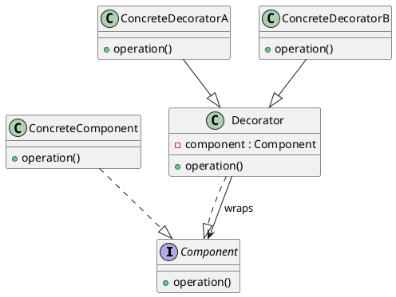

%% [[Design Pattern]] %%
Decorator Pattern（装饰器模式），是一种Structural Pattern（结构型设计模式），在不修改原对象的情况下，动态增强对象功能。

![[Decorator Pattern.png]]
%% 

%%
设计要点：
1. Component
2. Concrete Component
3. Decorator
4. Concrete Decorator

Component，所有对象共同的接口，例如：
```Go
type Payment interface {
    Pay(amount float64)
}
```
无论是原对象还是装饰器都需要实现这个接口。
Concrete Component，完成具体的业务
```Go
type WechatPay struct{
		// ...
}
```
这里只有支付相关的微信支付相关的逻辑。
Decorator，通常保存Component，负责调用Pay方法。
```Go
type PaymentDecorator struct { 
	payment Payment 
}
```
Concrete Decorator，每一种装饰器表示一种能力，例如：LoggingDecorator，MetricsDecorator，CacheDecorator
一个完整的例子：
```Go
package main

import (
	"fmt"
	"time"
)

type Payment interface {
	Pay(amount float64)
}

// Concrete Component
type WechatPay struct{}

func (w *WechatPay) Pay(amount float64) {
	fmt.Printf("微信支付 %.2f 元\n", amount)
}

// Decorator
type PaymentDecorator struct {
	payment Payment
}

func NewPaymentDecorator(payment Payment) PaymentDecorator {
	return PaymentDecorator{
		payment: payment,
	}
}

func (d *PaymentDecorator) Pay(amount float64) {
	d.payment.Pay(amount)
}

// Concrete Decorator
type LoggingDecorator struct {
	PaymentDecorator
}

func NewLoggingDecorator(payment Payment) Payment {
	return &LoggingDecorator{
		PaymentDecorator: NewPaymentDecorator(payment),
	}
}

func (l *LoggingDecorator) Pay(amount float64) {
	fmt.Println("记录支付日志：开始")

	l.PaymentDecorator.Pay(amount)

	fmt.Println("记录支付日志：结束")
}

// Concrete Decorator
type MetricsDecorator struct {
	PaymentDecorator
}

func NewMetricsDecorator(payment Payment) Payment {
	return &MetricsDecorator{
		PaymentDecorator: NewPaymentDecorator(payment),
	}
}

func (m *MetricsDecorator) Pay(amount float64) {
	start := time.Now()

	m.PaymentDecorator.Pay(amount)

	fmt.Println("支付耗时：", time.Since(start))
}

func main() {
	var payment Payment = &WechatPay{}

	payment = NewLoggingDecorator(payment)
	payment = NewMetricsDecorator(payment)

	payment.Pay(100)
}
```