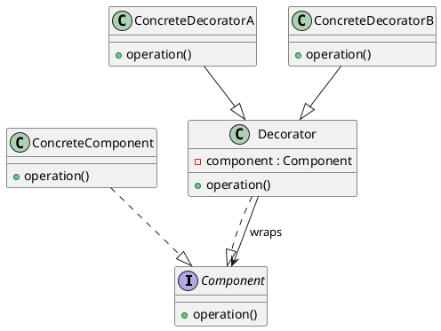

%% [[Design Pattern]] %%
Decorator Pattern（装饰器模式），是一种Structural Pattern（结构型设计模式），在不修改原对象的情况下，动态增强对象功能。

设计要点：
1. Component（抽象组件）
2. Concrete Component（具体组件）
3. Decorator（抽象装饰器）
4. Concrete Decorator（具体装饰器）
