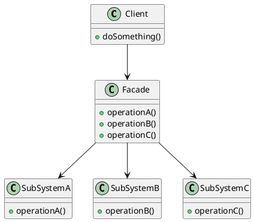

%% [[Design Pattern]] %%
Facade Patter（外观模式），为复杂的子系统提供一个简单、统一的访问入口，让客户端不需要了解子系统内部的调用细节。
![[Facade Pattern.png]]
%%

%%
设计要点：
1. Facade，对Client提供简单统一的方法
2. Subsystem，负责真正的功能
3. Client，仅依赖Facade
子系统，库存服务，订单服务，支付服务，物流服务，通知服务...
```Go
type InventoryService struct{}
type OrderService struct{}
type PaymentService struct{}
type ShippingService struct{}
type NotificationService struct{}
```
Facade，并且提供一个简单的方法
```Go
type OrderFacade struct {
	inventory    *InventoryService
	order        *OrderService
	payment      *PaymentService
	shipping     *ShippingService
	notification *NotificationService
}

func NewOrderFacade() *OrderFacade {
	return &OrderFacade{
		// ...
	}
}

func (f *OrderFacade) Purchase(
	product string, quantity int, amount float64,
) error {
	// ... 调用到不同子系统的服务
}
```
Client调用
```Go
func main() {
	facade := NewOrderFacade()
	err := facade.Purchase("iPhone", 1, 7999)
	if err != nil {
		fmt.Println("购买失败：", err)
		return
	}
	fmt.Println("购买完成")
}
```
在这个场景中，如果没有Facade提供的简单方法Purchase，那么Client则会直接调用Subsystem中的方法，Client就需要知道完整的流程。Facade Pattern只是提供一个更简单的接口，而不会阻止Client访问Subsystem。